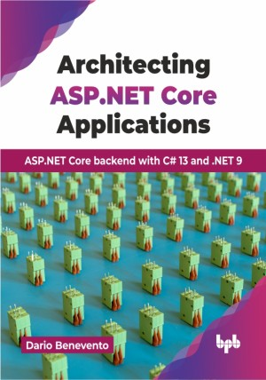

# Architecting ASP.NET Core Applications

ASP.NET Core backend with C# 13 and .NET 9.

This is the repository for [Architecting ASP.NET Core Applications
](https://bpbonline.com/products/architecting-asp-net-core-applications?_pos=1&_sid=8ab14ea7d&_ss=r?variant=44557391167688),published by BPB Publications.

## About the Book
Architecting ASP.NET Core Applications aims to be a reference guide for building modern, reliable, and scalable web applications. This book guides you from foundational concepts to advanced techniques, ensuring a solid understanding of ASP.NET Core's architecture and capabilities.

This book provides a practical guide to mastering ASP.NET Core, from fundamental design principles like SOLID to advanced concepts such as modular architecture, SignalR for real-time communication, and deploying with Docker and Kubernetes. It explains when and how to apply these techniques, offering hands-on examples with repositories for solving real-world challenges. Readers will learn key topics like RESTful API design, Clean Architecture, Domain-Driven Design, Hexagonal Architecture, routing, middleware, CQRS, and modular monoliths. The book also covers Blazor for frontend development, Entity Framework Core for data access, automated testing, security, debugging, and performance tuning, ensuring well-rounded expertise in ASP.NET Core development.

By the end of this book, you will be equipped to design and implement sophisticated ASP.NET Core applications, confidently applying architectural principles, best practices, and advanced techniques to build high-quality web solutions.

## What You Will Learn
• Design scalable and maintainable applications using popular principles like SOLID, DRY, and KISS.

• Understand the architecture of systems and how to apply these principles in real life.

• Implement secure, high-performance APIs and advanced deployment techniques.

• Use Docker and Kubernetes for modern systems.

• Solve real-world business problems with practical coding examples.

• Build modular architectures with real-time communication using SignalR.
